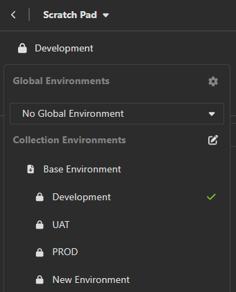

# API Enpoint Validation

To begin understanding API endpoint testing, we should first install an API client such as Insomnia. 

Insomnia helps developers and testers design, test, and debug APIs by sending API requests, analyzing responses, validating endpoints, and so much more.

In google, search for Insomnia REST. From there you can download Insomnia for free. 

You can choose to login if you wish, but for this demo we will be using the local scratch pad which is at the bottom of the page.

For the purposes of this demo, we will use this publicly available API (at the time of writing) found at https://restful-api.dev/.

In this API, they provide a list of endpoints for our use, the first one being a GET method for the endpoint: https://api.restful-api.dev/objects.

In Insomnia, next to the filter search, click the plus tab to create a new folder. Name your folder appropriately as that will be where our testing is stored. 

Under this folder, create a new HTTP request. Paste the endpoint link and change the method as required. For this example, we will keep the GET method, and paste the link mentioned above. Make sure to name this endpoint test appropriately under the folder, so we can reference it again when necessary.

When you send this, you get a 200 OK response along with all the objects.

Let us follow the next same steps for the next 6 endpoints provided by the API. For the POST, PUT, and PATCH methods, make sure to copy and paste the provided code into insomnia.

There will be a body section where you can choose the type of text you want to insert. The API provided the text in a JSON format which is what you will select. Upon sending to all these endpoints, you should be returned with a 200 response.

Note: For the PUT method, it will return an error if you simply copy-paste the endpoint link they provide: https://api.restful-api.dev/objects/7.

This is because 7 is a reserved id and the data object of it cannot be overridden. To overcome this, use the id generated by the POST method inplace of the 7. 

Your new url should look something like this: https://api.restful-api.dev/objects/ff808181932badb60193ff5b78c52c03.

Now that the endpoints have been setup, we will look into standardizing the domain. API endpoints are standardized to ensure consistency across different systems. This in turn makes it easier for developers and testers alike to integrate applications. 

To achieve this in Insomnia, on the left side of the page under scratch pad, there will be three icons. The first for global and collection environments, the second for cookies, and the third for certificates.

Under the first icon, there will be an edit icon next to Collection Environments. Upon clicking that, we will be redirected to a tab called Manage Environments.

Next to Base Environment, click the plus tab and create a private environment. Name this environment Development. Make Input Name "host" and make the Input Value the domain, which in this case is https://api.restful-api.dev.

On the top right, there will be the toggle to switch the table view on and off. Turn table view off and input this piece of code:

{
	"host": "https://api.restful-api.dev"
}

This sets the variable "host" to hold the domain.

Create two more private environments called UAT (for User Authorized Testing) and PROD (for Production). Follow the same format as above, but instead of ending the domain with .dev, end it with .uat and .prod instead.

Example: https://api.restful-api.uat

While these domains don't exist in the provided API, in real world API testing, similar domains will exist to seperate the development, testing, and production environments. For the purposes of this demo, we will just be practicing.

Once you are done, close the tab and return the main page. Now for all the endpoint links you have input, remove the domain and enter _.host. Make sure the environment is under Development instead of UAT or PROD (as these don't actually exist). 

Example: _.host/objects

Upon sending this request, the response should still be 200. If that is the case, we have officially standardized the API domain for development purposes.

If you click on the host variable in the url, it will show you the live preview of the domain. Switching between Development, UAT, and PROD will show you the different domains you have input.

Congrats with finishing Part 1!